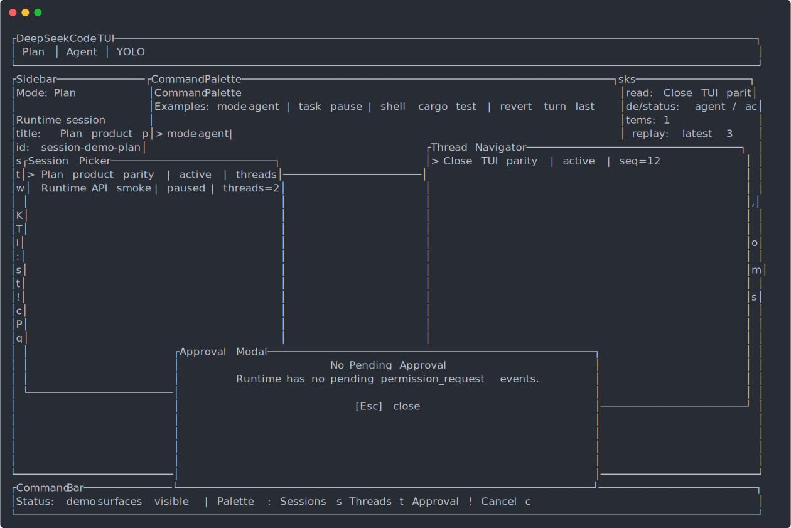

# DeepSeekCode

[English](./README.md) | [中文](./README.zh-CN.md)

DeepSeekCode is a DeepSeek-first terminal coding agent and local TUI/runtime
workbench. It is built for the loop you actually use while programming:
inspect a repository, edit files, run checks, review the result, and keep
iterating from the same terminal.

> Status: usable for dogfooding and repository work. It is not yet a polished
> hosted product, and the native PTY supervisor/release channels are still in
> progress.

<p align="center">
  
</p>

## What Works Today

- `deepseek run` for one-shot coding tasks.
- `deepseek tui` for a keyboard-driven terminal workbench with Plan / Agent /
  YOLO modes.
- Durable sessions, threads, turns, items, events, tasks, usage, and
  automations under `.dscode/runtime/`.
- File read/search, patch application, diff review, todo tracking, rollback
  snapshots, notes, memory, hooks, skills, and subagents.
- Permission-gated shell execution plus background shell jobs, wait/poll,
  replay, attach snapshots, stdin, resize metadata, cancellation, and a
  workspace shell-supervisor protocol bridge.
- Local HTTP/SSE runtime, ACP stdio adapter, MCP client/server tooling, and TUI
  MCP management screens.
- RLM helpers for recursive/long-input analysis, model-session context, live
  queue status, event replay, cancellation, recovery, and drain controls.
- LSP-backed and fallback diagnostics runners with JSON/JSONL watch output.
- Release packaging scaffolding for Cargo, npm wrappers, Docker, Homebrew
  formula rendering, and GitHub release assets.

## Quick Start

Install from source:

```bash
cargo install --git https://github.com/willamhou/DeepSeekCode.git --locked
deepseek version
deepseek doctor --json
```

Or use a local checkout:

```bash
cargo install --path .
deepseek config init
deepseek doctor --json
```

Run a coding task:

```bash
deepseek run "explain the current repository structure"
```

Start the TUI:

```bash
deepseek tui
deepseek tui --demo --once
```

Start the local runtime and connect the TUI:

```bash
deepseek serve --http --addr 127.0.0.1:13000
deepseek tui --runtime-url http://127.0.0.1:13000
```

Set `DEEPSEEK_API_KEY` for real model calls. Local `.env` files are ignored by
git.

## Current Gap

DeepSeekCode is close enough to use as its own coding CLI, but it is not yet at
Claude Code CLI / Codex CLI polish. The largest remaining gaps are:

- native supervisor-owned PTY attach/stdin/resize/replay/wait/cancel;
- live external write-fixture validation across real repositories;
- public release evidence for binary, npm, Homebrew, and container channels;
- product polish around onboarding, auth, model/provider setup, and demos.

## Demo Asset

The README demo image is generated from the deterministic TUI snapshot:

```bash
target/debug/deepseek tui --demo --once
```

For a launch-quality README, record a short GIF/MP4 of the real loop:
open TUI, submit a coding request, apply an edit, run tests, inspect the diff.
Keep generated media under `docs/demo/`.

## Development Checks

```bash
cargo fmt --check
cargo test --lib -- --test-threads=1
cargo package --allow-dirty
deepseek tui --demo --once
```

For npm wrapper metadata:

```bash
node npm/scripts/check-version-sync.js
```

For release readiness:

```bash
deepseek update publish-status
deepseek update publish-status --dist dist-assets --npm-dist npm-dist --strict
deepseek update publish-status --json
```

For PR/CI workflow checks:

```bash
deepseek pr live-status owner/repo#42
deepseek pr live-status owner/repo#42 --require-write
deepseek pr live-status owner/repo#42 --json
```

## Documentation

- [Install](./docs/install.md)
- [Architecture](./docs/architecture.md)
- [Runtime contract](./docs/runtime.md)
- [TUI workbench](./docs/tui.md)
- [REPL mode](./docs/repl.md)
- [Streaming](./docs/streaming.md)
- [Agent tasks](./docs/agents.md)
- [Todo tool](./docs/todos.md)
- [PR / CI integration](./docs/pr-integration.md)
- [Release checklist](./docs/release.md)
- [Roadmap](./docs/roadmap.md)
- [Changelog](./CHANGELOG.md)

## Repository Notes

This repository is public for transparency and collaboration. Public visibility
does not imply a separate open-source grant beyond the terms in
[LICENSE](./LICENSE).

Do not commit local credentials, API keys, runtime state, or private `.env`
files. The tracked examples use placeholders only.
